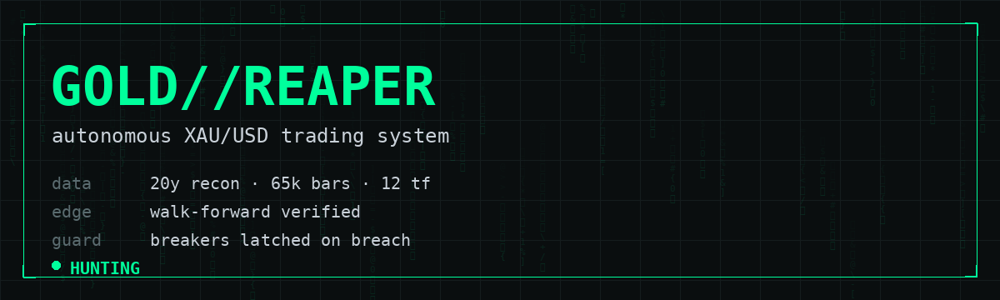

<div align="center">



# ☠️ 𝐆𝐎𝐋𝐃 𝐑𝐄𝐀𝐏𝐄𝐑 𝐀𝐏𝐄𝐗 ☠️

### *the 24/7 XAU/USD autonomous hunter — now measuring 142 features across 10 dimensions*

**`APEX-X Ensemble` · `HMM Regime Router` · `News Brain` · `Exness MT5` · `Bitget` · `Win + Linux`**

[](https://python.org)
[](#-installation--autostart)
[](LICENSE)
[](https://github.com/muhammadwhizz-web/gold-reaper/actions)

</div>

> **⚡ APEX UPGRADE — what changed:** the repo is now a full quant stack.
> **142 engineered features** (indicators × volatility models × market structure ×
> cross-asset cointegration × news sentiment) → **HMM regime router** → **APEX-X
> ensemble** (trend / mean-reversion / breakout / news modules + transparent ML soft
> vote) → **$20/4h block engine** with adaptive sizing, recovery mode and **latched
> circuit breakers** (day −3% / week −7% / month −15%) → **audit trail** of every
> decision → **Telegram/Discord/Email alerts** → **live dashboard** on :8050 →
> **multi-account + broker failover**. Full architecture + honest backtest verdicts:
> **[docs/APEX.md](docs/APEX.md)**.

<div align="center">


```text
┌─────────────────────────────────────────────────────────────┐
│  > init reaper.exe --target XAUUSD --mode 24/7              │
│  [✓] 20 years of gold data ingested  (5,032 daily bars)     │
│  [✓] kill zone located               12:00–16:00 UTC        │
│  [✓] REAPER-X strategy compiled      walk-forward verified  │
│  [✓] circuit breakers armed          you cannot YOLO here   │
│  [✓] brokers linked                  Exness · Bitget · PAPER│
│  > status: HUNTING . . .                                          │
└─────────────────────────────────────────────────────────────┘
```

</div>

---

## ⚠️ READ THIS OR GET REKT

> **No bot on planet Earth guarantees $120/day.** Anyone who promises that is lying to you.
> What this bot **does** is hunt those targets with a *verifiable* strategy, hard risk
> limits, and full transparency — and it **refuses to trade** when conditions are wrong.
> Gold moves **$100+ some days**. Leverage cuts both ways. Run **PAPER mode first**.
> Backtested ≠ future profit. Past performance does **not** guarantee anything.
> *We are the Python Hunters — we hunt, we don't gamble.*

---

## 🩸 The Mission

| Target | Value | How the reaper enforces it |
|---|---|---|
| 🔥 Session profit | **$20 / session** | stops trading that session when hit |
| 🔥 Daily profit | **$120 / day** | kills the engine when hit |
| 🛡️ Daily loss stop | **-3% equity** | full stop, no revenge trades |
| 🛡️ Loss streak | **3 losses** | cooldown until next session |
| 🛡️ Risk per trade | **1% equity** | auto position sizing in oz |
| 🛡️ Weekend guard | no entries | 2h before Friday close |

## 🧠 REAPER-X :: the strategy

Forged on **20 years of XAU/USD recon** (`data/fetch_history.py` — ingests real history),
then optimized with a **4-fold walk-forward** so it doesn't fool itself:

```text
recon findings (real data, 2006 → 2026):
  gold went $578 → $4,211  (+7.28x)
  kill zone hourly range : LONDON/NY OVERLAP 0.60%  (12–16 UTC)
  dead zone hourly range : late US session   0.33%
  most explosive hour    : 13:00–14:00 UTC

REAPER-X rules (H4 bias → H1 execution):
  1. BIAS    H4 close vs EMA50 vs EMA200 → LONG / SHORT / STAND DOWN
  2. TRAP    price must pull back within 0.6×ATR of EMA20
  3. RESET   RSI(14) resets into the reload zone (L 38–52 / S 48–62)
  4. KILL    body candle re-ignites in bias direction + ADX ≥ 24 (trend live)
  5. RISK    SL 1.2×ATR · TP 3.2×ATR · breakeven @ +1R · ATR trail @ +1.5R
  6. FILTER  US-data blackouts 12:25 / 13:25 UTC · Friday cutoff · weekend lock
```

## 📊 Walk-Forward Verdict *(real backtest, 2024-05 → 2026-10)*

```text
════════════════════════════════════════════════════════════
 REAPER-X :: BACKTEST VERDICT        1% risk, compounding
════════════════════════════════════════════════════════════
 trades            40 (overlap-only)     win rate    50.0%
 net result        +1,417 USD (+14.2%)   profit fctr 1.70
 CAGR              +5.7% / yr            max DD      -7.1%
 pnl/yr            2024: +1,060 · 2025: +620 · 2026: -263
════════════════════════════════════════════════════════════
 verdict: real, modest, honest edge — NOT a money printer.
```

> 🔬 Reproduce it yourself: `python data/fetch_history.py && python research/backtest.py`

## 🗡️ Brokers

| Broker | Route | Asset | OS |
|---|---|---|---|
| **Exness** | MetaTrader 5 (`MetaTrader5` pkg) | `XAUUSD` spot gold | Windows native · Linux via Wine |
| **Bitget** | `ccxt` REST (futures) | `XAUT/USDT` tokenized gold | native Linux + Windows |
| **PAPER** | built-in simulator, spread+slippage | virtual | everything, zero risk |

## ⚡ Installation & Autostart

### 🐧 Linux
```bash
git clone https://github.com/muhammadwhizz-web/gold-reaper.git
cd gold-reaper
chmod +x install_linux.sh && ./install_linux.sh     # installs venv + systemd autostart
cp .env.example .env && nano .env                   # your keys live here (never committed)
systemctl --user start gold-reaper
tail -f data/reaper.log
```

### 🪟 Windows
```powershell
git clone https://github.com/muhammadwhizz-web/gold-reaper.git
cd gold-reaper
powershell -ExecutionPolicy Bypass -File install_windows.ps1   # venv + Task Scheduler autostart
notepad .env                                                    # MT5 login / Bitget keys
Start-ScheduledTask -TaskName GOLD-REAPER                       # boots with Windows forever
```

Both installers register the reaper as a **boot service** — crash? it restarts in 30s.
Reboot? it comes back. It only dies when you tell it to.

## 🎛️ Going Live (when you're ready)

```env
# Exness route
BROKER=MT5
PAPER_MODE=false
MT5_LOGIN=your_exness_login
MT5_PASSWORD=***
MT5_SERVER=Exness-MT5Real8          # exact server name from your Exness dashboard

# Bitget route
BROKER=BITGET
PAPER_MODE=false
BITGET_KEY=***
BITGET_SECRET=***
BITGET_PASSPHRASE=***
```

**Protocol: 2 weeks paper → then 0.01-lot live → then scale risk. Never skip the line.**

## 🗂️ Arsenal

```text
gold-reaper/
├── bot.py                    # the 24/7 hunter loop — main entry
├── core/
│   ├── config.py             # every dial & switch (.env overrides)
│   ├── strategy.py           # REAPER-X signal engine + trade manager
│   ├── risk.py               # circuit breakers, sizing, targets
│   ├── indicators.py         # EMA / RSI / ATR / ADX — pure pandas
│   ├── sessions.py           # session clock, blackout & weekend guards
│   └── logger.py             # blood-red console + rotating file log
├── brokers/
│   ├── base.py               # broker contract
│   ├── mt5_broker.py         # Exness via MetaTrader 5
│   ├── bitget_broker.py      # Bitget futures via ccxt
│   └── paper_broker.py       # full simulation (default)
├── research/
│   ├── backtest.py           # replay engine, spread+slippage aware
│   └── optimize.py           # 4-fold walk-forward optimizer
├── data/fetch_history.py     # 20-year XAU/USD data hunter
├── .github/workflows/        # 🐍 snake animation + CI blood test
├── install_linux.sh          # systemd autostart
└── install_windows.ps1       # Task Scheduler autostart
```

## 🔧 Daily Ops

```bash
python bot.py                        # run in foreground (PAPER default)
python bot.py --broker MT5           # force a broker
python research/backtest.py          # re-verify the edge
python research/optimize.py          # re-tune after big regime shifts
tail -f data/reaper.log              # watch the hunt
cat data/state.json                  # pnl / streaks / targets state
```

---

<div align="center">


**☠️ WE ARE THE PYTHON HUNTERS ☠️**
*we don't predict the market. we stalk it.*

```text
while market.opens():
    prey = strategy.locate(XAUUSD)
    if prey and risk.alive():
        execute(prey)          # clean. sized. circuit-broken.
    else:
        sleep(60)              # patience is a position
```

**TRADING RISK WARNING** — CFDs/futures/leveraged gold can wipe your account.
This software ships **PAPER MODE ON**. Flip to live at your own risk.
Educational software. No financial advice. *The reaper takes no responsibility —
only profits it hunts within your own hard limits.*

[⬆ back to top](#%EF%B8%8F-𝐠𝐨𝐥𝐝-𝐫𝐞𝐚𝐩𝐞𝐫-%EF%B8%8F)

</div>
