<div align="center">



# GOLD//REAPER

<a href="https://github.com/muhammadwhizz-web/gold-reaper">

</a>

<!-- badge wall · row 1: build & quality -->
[](https://github.com/muhammadwhizz-web/gold-reaper/actions/workflows/ci.yml)
[](pyproject.toml)
[](LICENSE)
[](pyproject.toml)
[](pyproject.toml)
[](docs/GETTING_STARTED.md)

<!-- badge wall · row 2: activity -->
[](https://github.com/muhammadwhizz-web/gold-reaper/commits/main)
[](https://github.com/muhammadwhizz-web/gold-reaper/graphs/commit-activity)
[](https://github.com/muhammadwhizz-web/gold-reaper/stargazers)
[](https://github.com/muhammadwhizz-web/gold-reaper/network/members)
[](https://github.com/muhammadwhizz-web/gold-reaper/issues)
[](https://github.com/muhammadwhizz-web/gold-reaper/graphs/contributors)

<!-- badge wall · row 3: project -->
[](docs/STRATEGY.md)
[](docs/RISK.md)
[](https://muhammadwhizz-web.github.io/gold-reaper/)
[](docs/ARCHITECTURE.md)
[](docs/ARCHITECTURE.md)
[](docs/DIAGNOSIS.md)

<!-- badge wall · row 4: custom dark -->
[](docs/STRATEGY.md)
[](docs/STRATEGY.md)
[](features/build_features.py)
[](features/build_features.py)
[](docs/GETTING_STARTED.md)

<br>

[▶ LIVE DEMO](https://muhammadwhizz-web.github.io/gold-reaper/) · [▶ WATCH THE HUNT](docs/DEMO.md) · [docs](docs/ARCHITECTURE.md) · [diagnosis](docs/DIAGNOSIS.md) · [track record](docs/TRACK_RECORD.md)

`gold trading bot` · `xauusd bot` · `metatrader5 python` · `bitget ccxt` ·
`algorithmic trading python` · `walk-forward backtest` · `autonomous trading system`

</div>

---

## What it is

GOLD//REAPER is an autonomous **XAU/USD (gold) trading bot** written in
Python 3.10–3.12. It ingests 20 years of market history, measures **142
features across 10 dimensions** — trend, order flow, volatility, structure,
statistical, session, microstructure, cross-asset, news, regime — and hunts
through a regime-routed ensemble called **APEX-X**. Execution runs on
**Exness via MetaTrader 5**, **Bitget futures via ccxt**, or a built-in paper
simulator, 24/7, under systemd or Task Scheduler, with latched circuit
breakers between the market and your account. Every decision lands in an
append-only audit trail, every number in this README is reproducible with one
command, and the walk-forward verdict — including the losing regimes — is
published below.

## Status

```text
┌─ reaper ──────────────────────────────── 12:04:33 UTC ─┐
│ session  london/ny overlap   ● HUNTING                 │
│ equity   10,000.00 USD       +0.42% today              │
│ open     1 x XAUUSD long     2,418.60 → TP 2,431.20    │
│ guard     daily -3% · block +$20 · streak 1            │
│ mode      PAPER · v3 hardened · hunt 12–14 UTC         │
└────────────────────────────────────────────────────────┘
```

## Architecture

```text
data acquisition        features + cognition          decision            execution
─────────────────       ────────────────────          ──────────          ─────────
yfinance 1m→1mo    ─┐   142 features · 10 dims        APEX-X ensemble     MT5 (exness)
dukascopy ticks    ─┼─▶ HMM regime router        ──▶ consensus vote  ──▶ bitget (ccxt)
forexfactory news  ─┘   news + sentiment               risk gates          paper sim
        │                  │                              │                   │
        └──────── duckdb store ── audit.jsonl ◀──────────┴───────────────────┘
                                 (append-only black box)
```

Full module map: [docs/ARCHITECTURE.md](docs/ARCHITECTURE.md)

## Strategy — REAPER-X + APEX-X, regime-routed

Forged on 20 years of gold data, tuned by a **4-fold walk-forward optimizer**
ranked by worst fold, then re-diagnosed and hardened in v2.3
([docs/DIAGNOSIS.md](docs/DIAGNOSIS.md)):

```text
recon findings:            gold $578 → $4,211 (+7.28x) over 20y
                           kill zone: london/ny overlap — hours 12–14 UTC pay,
                           14–15 UTC bleed (walk-forward: -1,010 combined)

REAPER-X (trend module):   h4 bias (ema50/ema200)
                           h1 pullback to ema20 (0.6x atr)
                           rsi reload zone (L 38-52 · S 48-62)
                           body-candle trigger + adx ≥ 24
                           SL 1.2x atr · TP 2.0R · BE +1R · trail +1.5R

APEX-X (ensemble):         regime-routed modules vote:
                             TREND (reaper-x) · MEANREV (bb+rsi+z, vol-rank < 0.4)
                             BREAKOUT (donchian+flow) · NEWS (post-event)
                           consensus ≥ 2.5 weight + ≥ 2 rule modules
                           xgboost soft vote ±0.5 (hard gate arms only if
                           a retrain clears OOS AUC ≥ 0.56)
```

Details and findings: [docs/STRATEGY.md](docs/STRATEGY.md)
Every tuned number, its env key, its constraint and its consumer module
lives in one table: [docs/PARAMETERS.md](docs/PARAMETERS.md) — the single
source of truth (README and docstrings reference it, never restate it).
The reliability contract of the current release (exit execution, paper
persistence, feed validation, explicit failover, install gate) is
documented in [docs/AUDIT.md](docs/AUDIT.md) and proven in
[docs/REPAIR_REPORT.md](docs/REPAIR_REPORT.md).

## Backtest verdict — the honest section

Canonical walk-forward engine (`research/backtest_apex.py`): no same-bar
re-entry, slippage both sides, SL-first fills, expanding-window ML per fold.
Window: 13,722 hourly bars, 2024-05-17 → 2026-10-09, 4 chronological folds —
including the 2026 regime break that eats most strategies alive.

```text
metric             REAPER-X   ENSEMBLE   APEX-X    V3 hard    APEX-X v3
trades                  9         48       36        11          8
net (USD)           -467.37    -970.12  -736.40    +33.91     +356.39
win rate %           22.22      33.33    36.11     45.45      62.50
profit factor         0.35       0.66     0.63      1.06       2.57
max drawdown %        -7.04     -14.17   -11.97     -5.14      -2.12
worst fold (USD)    -317.13    -663.31  -775.06   -112.04    -113.24
```

- v2.2 lost money and we said so. **v3 is the diagnosed fix** — hunt hours
  12–14 UTC only, TP retuned 2.67R → 2.0R, mean-reversion gated to low-vol
  tape. Worst fold improved **-663 → -112**; full-period net **-970 → +34**.
- **8–11 trades is an anecdote, not a sample.** PF 2.57 on 8 trades is
  indistinguishable from luck. The paper track record below is the
  arbitration — if v3 is a statistical accident, the ledger will say so in
  public.
- The diagnosis that produced v3, including the buckets that lose and the
  hypotheses that were tested and rejected: [docs/DIAGNOSIS.md](docs/DIAGNOSIS.md)
- Tabular ML (XGBoost, 142 features) did **not** clear OOS AUC 0.56 on hourly
  (0.500) or 20-year daily (0.528) gold — twice tested, twice rejected. The
  meta-model runs as a transparent soft vote only.
- Silver: the same hunt loses (-5,782 walk-forward). EURUSD: zero qualifying
  entries. REAPER-X is gold-specific and we publish that.

Reproduce:
`python data/ingest_multi_tf.py && python features/build_features.py && python research/backtest_apex.py`

## Paper track record — live, append-only

The bot runs in PAPER mode by default and every UTC day gets one immutable
row, win or lose: **[docs/TRACK_RECORD.md](docs/TRACK_RECORD.md)**.
Protocol: 2 weeks paper → 0.01 lots → scale — only if the ledger and the
risk contract agree.

| date (UTC) | trades | net PnL ($) | note |
|------------|-------:|------------:|------|
| 2026-10-09 | 0 | +0.00 | ledger opened · v2.3 v3-hardened config · paper-first protocol begins |

Appended automatically by `research/track_record.py` (systemd timer ships
with the Linux install).

## Features grid

| | |
|---|---|
| **10-dimension feature forge** — 142 features over 13.7k hourly bars, 98% coverage, zero lookahead | **HMM regime router** — TREND_UP / TREND_DOWN / RANGE / VOLATILE_CHOP / CRISIS with deterministic fallback |
| **APEX-X ensemble** — four rule modules + ML soft vote, consensus-weighted | **Circuit-broken risk** — day -3% / week -7% / month -15% latched stops, 4h block tracker, adaptive sizing |
| **Bulletproof brokers** — MT5 terminal auto-detect, symbol fallback chain, exponential-backoff reconnect; Bitget IP-whitelist guidance; guaranteed paper fallback | **24/7 ops** — supervisor loop, watchdog process, heartbeat, NTP drift check, memory/disk guards, Telegram/Discord alerts |

## Brokers

| broker | market | notes |
|---|---|---|
| **MetaTrader 5** (Exness) | XAUUSD CFD | Windows binary (Linux via fallback); auto-detects terminal, retries login ×3, symbol chain `XAUUSD → XAUUSDm → XAUUSD.raw → GOLD` |
| **Bitget** (ccxt) | XAUT/USDT perp | leverage + position-mode setup, rate-limit backoff, IP-whitelist error guidance |
| **Paper** (built-in) | simulated | $0.35 spread + $0.05 slippage, always available, the default |

Failover chain `MT5 → BITGET → PAPER` is configurable via `FAILOVER_CHAIN`.
The bot never trades live unless you explicitly set `PAPER_MODE=false`.

## Installation — one command (or one double-click)

Every installer: checks Python (3.10–3.12, installs it if missing) → copies
the app → creates the venv → installs requirements → runs the **setup
wizard** (broker, API keys, risk) → creates a **desktop icon: "Gold
Reaper"** → registers 24/7 autostart with auto-restart + watchdog.

### Linux / Debian / Ubuntu / Fedora / Arch

```bash
git clone https://github.com/muhammadwhizz-web/gold-reaper.git
cd gold-reaper && chmod +x install_linux.sh && ./install_linux.sh
```

Desktop icon + Applications menu entry, systemd user services
(`Restart=always`, linger for no-login 24/7), dashboard on :8080, weekly
retrain timer. Or install the `.deb` from
[Releases](https://github.com/muhammadwhizz-web/gold-reaper/releases).

### Windows 10 / 11

```powershell
# one command (or download GoldReaper-Setup.exe from Releases and double-click)
git clone https://github.com/muhammadwhizz-web/gold-reaper.git
cd gold-reaper && powershell -ExecutionPolicy Bypass -File install_windows.ps1
```

Desktop + Start Menu shortcut, Task Scheduler tasks (logon + boot, hidden,
restart every 60s), venv under `%LOCALAPPDATA%\GoldReaper`. The `.exe`
installer (Inno Setup) bundles the same flow with an uninstaller in
Add/Remove Programs.

### macOS 12+

```bash
chmod +x install_macos.sh && ./install_macos.sh
```

`/Applications/Gold Reaper.app` + LaunchAgent (`KeepAlive`) — or drag
`GoldReaper.dmg` from Releases.

### After any install

```text
desktop icon  -> double-click "Gold Reaper" (wizard on first run, then
                 bot + dashboard start and http://localhost:8080 opens)
no terminal   -> the wizard runs once; everything else is automatic
watchdog      -> data/heartbeat.json checked every 60s; wedged bot restarts
failover      -> MT5 -> Bitget -> Paper, exponential backoff, never dies
reset breakers: python bot.py --reset-breakers
```

Full non-technical walkthrough: **[docs/GETTING_STARTED.md](docs/GETTING_STARTED.md)** ·
Errors and fixes: **[docs/TROUBLESHOOTING.md](docs/TROUBLESHOOTING.md)**

Going live later: `BROKER=MT5` (or `BITGET`) + `PAPER_MODE=false` in `.env`
(re-run `python -m setup.wizard` to do it interactively). Risk contract:
[docs/RISK.md](docs/RISK.md)

## Live demo — three layers

| Layer | Command | What you get |
|---|---|---|
| Terminal | `python demo/terminal_demo.py` | boot sequence, matrix overture, deterministic simulated hunt with fill + protective moves + session summary |
| Web | `python dashboard/app.py` → :8080 | equity curve, regime + radar, gauges, position card, sortable trades, per-session P&L rollup, weekday×hour PnL heat grid with click-to-filter journal, hunt-window attribution line, SSE log tail, broker LEDs, keyboard shortcuts (`s` `p` `j` `k` `o` `c` `e` `l` `d`) — attaches to a live bot when present, mock session otherwise |
| Static | [▶ LIVE DEMO](https://muhammadwhizz-web.github.io/gold-reaper/) | backend-free GitHub Pages build, works on mobile |

Record your own: `bash demo/record_demo.sh` (or `demo/record_demo.ps1` on
Windows) → `.cast` + `.gif` + `.mp4`. Guide: [docs/DEMO.md](docs/DEMO.md)

## Roadmap

- [x] v1 — REAPER-X core, walk-forward tuning, brokers, autostart
- [x] v2 — APEX stack: 10-dimension features, regime router, ensemble,
      block risk engine, audit, alerts, dashboard
- [x] v2.1 — professional rebrand, demo suite, GitHub Pages
- [x] v2.2 — one-click cross-platform installers (desktop icons, setup
      wizard, watchdog, tray, broker factory + health monitor, Inno Setup
      `.exe` / `.deb` / `.dmg` release pipeline)
- [x] v2.3 — signal diagnosis + hardened config: worst fold -663 → -112,
      append-only paper track record, full visual overhaul
- [ ] v2.4 — OANDA/IBKR broker adapters, order-flow tick features from the
      Dukascopy layer, per-regime parameter sets
- [ ] v3 — meta-model OOS gate cleared → hard ML veto arms automatically;
      portfolio mode (XAU + correlated assets)

## Risk disclaimer

Trading leveraged gold (CFDs, futures, tokenized metals) carries a
substantial risk of loss and is not suitable for every investor. This
software is educational, ships in **paper mode**, and publishes losing
regimes alongside winning ones. Past performance — backtested or live — does
not guarantee future results. You are solely responsible for your capital.
Read [docs/RISK.md](docs/RISK.md) before enabling live execution.

## License & credits

MIT — see [LICENSE](LICENSE). Built with Python 3.10–3.12, pandas, NumPy,
DuckDB, XGBoost, hmmlearn, statsmodels, ccxt, MetaTrader5, FastAPI, rich,
Chart.js. Brand system: [docs/BRAND.md](docs/BRAND.md).

<details>
<summary>Repository map</summary>

```text
bot.py · core/ (strategy, strategy_apex, regime, news_brain, risk, risk_apex,
audit, notify, sessions, indicators, config, logger, dashboard)
brokers/ (mt5, bitget, paper, factory, health) · features/ (build_features, store)
ml/ (train_meta, retrain_schedule) · research/ (backtest_apex, diagnose,
tune_v3, track_record, backtest, optimize, sweep_labels, sweep_daily)
data/ (ingest_multi_tf, ingest_ticks, news_ingest, fetch_history)
demo/ (terminal_demo, record_demo.sh, record_demo.ps1) · dashboard/ (app, static)
setup/ (wizard) · watchdog.py · system_tray.py · docs/ · assets/ · installer/ · .github/
```
</details>
